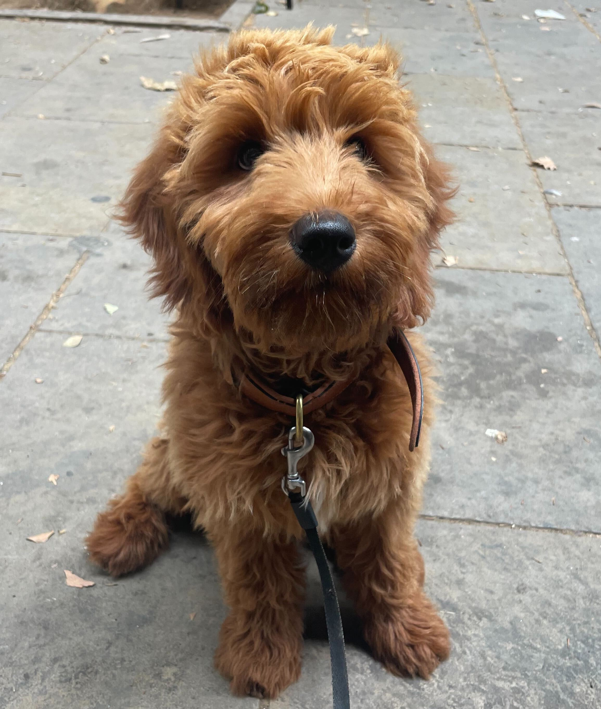

layout: true

<style>
.onehundredtwenty {
  font-size: 120%;
   }

<style>
.ninety {
  font-size: 90%;
   }

.eightyfive {
  font-size: 85%;
   }
   
.eighty {
  font-size: 80%;
   }
   
.seventyfive {
  font-size: 75%;
   }
   
.seventy {
  font-size: 70%;
   }
   
.fifty {
  font-size: 50%;
   }
   
.forty {
  font-size: 40%;
   }
</style>


```{r meta, echo=FALSE, warning = F, message=F}
library(metathis)
meta() %>%
  meta_general(
    description = "Data wrangling",
    generator = "xaringan and remark.js"
  ) %>%
  meta_name("github-repo" = "nataliaumansky/xxx") %>%
  meta_social(
    title = "Data wrangling",
    url = "nataliaumansky.github.io",
    og_type = "website",
    og_author = "Natalia Umansky",
    twitter_card_type = "summary_large_image",
    twitter_creator = "@NataliaUmansky"
  )
```

```{r setup, include=FALSE}
# dateWritten <- format(as.Date('2020-05-04'), format="%B %d %Y")
workshop_day <- format(as.Date("2024-04-06"), format="%B %d %Y")
pacman::p_load(tidyverse, fontawesome, tidyverse, knitr)

options(
    htmltools.dir.version = FALSE,
    knitr.table.format = "html",
    knitr.kable.NA = ""
)
knitr::opts_chunk$set(
    warning = FALSE,
    message = FALSE,
    fig.path = "figs/",
    fig.width = 7.252,
    fig.height = 4,
    comment = "#>",
    fig.retina = 3 # Better figure resolution
)
# Enables the ability to show all slides in a tile overview by pressing "o"
xaringanExtra::use_tile_view()
xaringanExtra::use_panelset()
xaringanExtra::use_clipboard()
# xaringanExtra::use_share_again()
# xaringanExtra::style_share_again(share_buttons = "all")
xaringanExtra::use_extra_styles(
  hover_code_line = TRUE,
  mute_unhighlighted_code = FALSE
)
# xaringanExtra::use_webcam()


knitr::opts_chunk$set(warning = F, message = F) # Whether to display errors
```


---
name: title-slide
class: primary


#.fira[`r rmarkdown::metadata$title`] 

###.fancy[`r rmarkdown::metadata$subtitle`]


<br>


Natalia Umansky <br> .small[University of Zurich]

[`r fa(name = "twitter", fill = "black")` @NataliaUmansky](http://twitter.com/NataliaUmansky)<br>
[`r fa(name = "github", fill = "black")` @NataliaUmansky](http://github.com/NataliaUmansky)<br>
[`r fa(name = "link", fill = "black")` nataliaumansky.github.io](http://nataliaumansky.github.io)


`r workshop_day`

.fifty[Link to slides: [nataliaumansky.github.io/data_wrangling_1](https://nataliaumansky.github.io/data_wrangling_1)]

---

### Your R Instructor

.leftcol40[


]

.rightcol60[
+ Postdoc at the DigDem Lab (University of Zurich)

+ PhD from Connected_Politics Lab (University College Dublin)

+ Passionate about Digital Communication and Data Science

+ Addicted to social media and overusing memes in my slides `r fa(name = "face-grimace")`

+ Love spending time with Mila `r fa(name = "dog", fill = "black")`

]

--

.leftcol40[



]

---

class: secondary

## But enough of me

### Let's learn some R! 

---

## .fancy[Schedule]

|When?                           | What?                              | 
|:-------------------------------|-----------------------------------:|
|9:30 - 10:30                    |Welcome to the `tidyverse`          |
|10:30 - 10:45                   |Coffee break                        |
|10:45 - 12:15                   |Data wrangling I                    |
|12:15 - 13:15                   |Lunch                               |
|13:15 - 14:45                   |Data wrangling II                   |
|14:45 - 15:00                   |Coffee break                        |
|15:00 - 16:30                   |Data wrangling III                  |

---

.hero[### It's not unusual to struggle at first...]

<br>

```{r, echo = F, out.width="90%", fig.align = 'center'}
knitr::include_graphics("images/r_first_then_new.png")
```


<!-- {width=50%} -->

.fifty[Illustration adapted from [Allison Horst](https://twitter.com/allison_horst)]

--

<center>

.font180[.fancy[but it gets better!]]

</center>

---

<center>

.font190[A note on live-coding]

</center>


<br>

```{r, echo = F, out.width="90%", fig.align = 'center'}
knitr::include_graphics("https://cdn.myportfolio.com/45214904-6a61-4e23-98d6-b140f8654a40/118ae091-4329-4382-8cb8-012035593dfc_rw_1920.png?h=29e95985575f458232d53ad93d1860cb")
```

---

## Overview

+ Data Manipulation

  + the tidyverse and friends
  
  + `janitor`
  
  + `tidyr`
  
  + `dplyr`
  
  + Exercises
  
---


.leftcol75[

## .green[Rmarkdown]

]

.rightcol25[


```{r, echo = F, out.width=100, out.height=120, fig.align='right'}
knitr::include_graphics("https://rmarkdown.rstudio.com/docs/reference/figures/logo.png")
```

]


.leftcol[
<center>

</center>

.fifty[Artist: [Allison Horst](https://github.com/allisonhorst)]
]

.rightcol[
* create *documents* with R
  
* mix code, text and graphs as you like

* write your thesis, create slides, automated reports, dashboards and interactive web apps all from within [Rmarkdown](https://rmarkdown.rstudio.com/docs/articles/rmarkdown.html)
  
]

---

# Before we begin

## Workshop files

Please download the workshop slides 

---

class: center, middle, inverse


---

## What is the `tidyverse`?

The tidyverse describes itself:

> The tidyverse is an opinionated **collection of R packages** designed for data science. All packages share an underlying design philosophy, grammar, and data structures.


<center>

</center>

---

## Core principle: tidy data

* Every column is a variable.
* Every row is an observation.
* Every cell is a single value.

We have already seen tidy data:

| Animal | Maximum Lifespan | Animal/Human Years Ratio  |
| --- | --- | --- | 
| Domestic dog | 24.0 | 5.10 |
| Domestic cat | 30.0 | 4.08 |
| American alligator | 77.0 | 1.59 | 
| Golden hamster | 3.9 | 31.41 |
| King penguin | 26.0 |  4.71 |

---

## Untidy data I

.leftcol[
| Animal | Type | Value  |
| --- | --- | --- | 
| Domestic dog | lifespan | 24.0 |
| Domestic dog | ratio | 5.10 |
| Domestic cat | lifespan | 30.0 |
| Domestic cat | ratio | 4.08 |
| American alligator | lifespan | 77.0 | 
| American alligator | ratio | 1.59 |
| Golden hamster | lifespan | 3.9 |
| Golden hamster | ratio | 31.41 |
| King penguin | lifespan |  26.0 |
| King penguin | ratio |  4.71 |
]

.rightcol[

<br>

<br>

The data on the right has multiple rows with the same observation (animal).

= .fancy[.font150[.red[not tidy]]]

]

---

## Untidy data II

| Animal | Lifespan/Ratio  |
| --- | --- | 
| Domestic dog | 24.0 / 5.10 |
| Domestic cat | 30.0 / 4.08 |
| American alligator | 77.0 / 1.59 | 
| Golden hamster | 3.9 / 31.41 |
| King penguin | 26.0 /  4.71 |

The data above has multiple variables per column = .fancy[.font150[.red[not tidy]]]

---

## Core principle: tidy data

<center>

</center>

.fifty[Artist: [Allison Horst](https://github.com/allisonhorst)]
---

## Core principle: tidy data

Tidy data has two decisive advantages:

* Consistently prepared data is easier to read, process, load and save.

* Many procedures (or the associated functions) in R require this type of data.

<center>

</center>

.fifty[Artist: [Allison Horst](https://github.com/allisonhorst)]


---


## Installing and loading the tidyverse

First we install the packages of the tidyverse like this:

```{r, eval = F}
install.packages("tidyverse")
```

Then we load them:

```{r}
library(tidyverse)
```

---


## A new dataset appears..

We are going to work with a new data from here on out.

No worries, we will stay within the animal kingdom but we need a dataset that is a little more complex than what we have seen already.


---

## A new dataset appears..

We are going to work with a new data from here on out.

Meet the Palmer penguins! Data were collected and made available by [Dr. Kristen Gorman](https://www.uaf.edu/cfos/people/faculty/detail/kristen-gorman.php) and the [Palmer Station, Antarctica LTER](https://pal.lternet.edu/).


.leftcol[
<center>

</center>
]

.rightcol[
<center>

</center>
.right[
.fifty[Artist: [Allison Horst](https://github.com/allisonhorst)]]
]


---

## Palmer Penguins

We could install the R package `palmerpenguins` and then access the data. 

However, we are going to use a different method: directly load a .csv file (comma-separated values) into R from the internet.

We can use the `readr` package which provides many convenient functions to load data into R. Here we need `read_csv`:

```{r}
penguins_raw <- read_csv("https://raw.githubusercontent.com/allisonhorst/palmerpenguins/main/inst/extdata/penguins_raw.csv")

```

---


## Palmer Penguins

```{r}
penguins_raw
```

---


## Palmer Penguins

We can also take a look at data set using the `glimpse` function from `dplyr`.

```{r}
glimpse(penguins_raw)
```

---

class: center, middle, inverse

## initial data cleaning

### using `janitor`


<center>

</center>


---


.leftcol75[

## cleaning with `janitor`

]

.rightcol25[


```{r, echo = F, out.width=100, out.height=120, fig.align='right'}
knitr::include_graphics("https://github.com/sfirke/janitor/raw/main/man/figures/logo_small.png")
```

]

`janitor` is not offically part of the tidyverse package compilation but in my view it is incredibly important to know.

Provides some convenient functions for basic cleaning of the data.

Just like any tidverse-style package it fullfills the following criteria for its functions:

> The data is always the first argument.

This helps us to match by position.

---

.leftcol75[

## cleaning with `janitor`

]

.rightcol25[


```{r, echo = F, out.width=100, out.height=120, fig.align='right'}
knitr::include_graphics("https://github.com/sfirke/janitor/raw/main/man/figures/logo_small.png")
```

]

One annoyance with the `penguins_raw` data is that it has spaces in the variable names. Urgh! 

R has to put quotes around the variable names that have spaces:

```{r, eval=F}
penguins_raw$`Delta 15 N (o/oo)`
penguins_raw$`Flipper Length (mm)`

```

`janitor` can help with that: 

using a function called `clean_names()`

---


.leftcol75[

## cleaning with `janitor`

]

.rightcol25[


```{r, echo = F, out.width=100, out.height=120, fig.align='right'}
knitr::include_graphics("https://github.com/sfirke/janitor/raw/main/man/figures/logo_small.png")
```

]

`clean_names()` just magically turns all our messy column names into readable lower-case snake case:

```{r}
library(janitor)

penguins_clean <- clean_names(penguins_raw) 

```

That is how the variables look like now:

```{r, eval=F}
penguins_clean$delta_15_n_o_oo
penguins_clean$flipper_length_mm
```


---


## cleaning with `janitor`


```{r}
glimpse(penguins_clean)

```


---

.leftcol75[

## cleaning with `janitor`

]

.rightcol25[


```{r, echo = F, out.width=100, out.height=120, fig.align='right'}
knitr::include_graphics("https://github.com/sfirke/janitor/raw/main/man/figures/logo_small.png")
```

]

Now we have another problem. Not all variables in the `penguins_clean` data set are that useful. 

Some of them are the same across all observations. We don't need those variables, like `region`.

```{r}
table(penguins_clean$region)
```

We can use the base R function `table` to quickly get some tabulations of our variable.

---

.leftcol75[

## cleaning with `janitor`

]

.rightcol25[


```{r, echo = F, out.width=100, out.height=120, fig.align='right'}
knitr::include_graphics("https://github.com/sfirke/janitor/raw/main/man/figures/logo_small.png")
```

]

Here to help get rid of these *constant* columns is the function `remove_constant()`.

```{r, message=T}
penguins_clean <- remove_constant(penguins_clean, quiet = F)


```

```{r, echo = F}
message("Removing 2 constant columns of 17 columns total (Removed: region, stage).")
```


When we set `quiet = F` we even get some input as to what exactly was removed. Neat!


Another useful function in `janitor` is `remove_empty()` which removes all rows or columns that just consist of missing values (i.e. `NA`)


---
class: coffee
---

class: center, middle, inverse

## Data cleaning using `tidyr`

<center>

</center>


---

.leftcol75[

## Data cleaning using `tidyr`

]

.rightcol25[


```{r, echo = F, out.width=100, out.height=120, fig.align='right'}
knitr::include_graphics("https://tidyr.tidyverse.org/logo.png")
```

]


Now we are already fairly advanced in our tidying.

But our dataset is still not entirely tidy yet.

Consider the `species` variable:

```{r}
table(penguins_clean$species)
```

---


## `tidyr`


```{r}
table(penguins_clean$species)
```

This variable violates the tidy rule that each cell should include a single value. 

Species hold both the *common name* and the *latin name* of the penguin.

---

.leftcol75[

## `tidyr`

]

.rightcol25[


```{r, echo = F, out.width=100, out.height=120, fig.align='right'}
knitr::include_graphics("https://tidyr.tidyverse.org/logo.png")
```

]

We can use a `tidyr` function called `separate()` to turn this into two variables.

Two arguments are important for that:

+ `sep`: specifies by which character the value should be split
+ `into`: a vector which specifies the resulting new variable names

---


.leftcol75[

## `tidyr`

]

.rightcol25[


```{r, echo = F, out.width=100, out.height=120, fig.align='right'}
knitr::include_graphics("https://tidyr.tidyverse.org/logo.png")
```

]

In our case we want to split by opening bracket `\\(` and will name our variables `species` and `latin_name`:

```{r}
penguins_clean <- separate(penguins_clean, species, sep = " \\(", into = c("species", "latin_name"))
```

```{r}
penguins_clean
```


---


.leftcol75[

## `tidyr`

]

.rightcol25[


```{r, echo = F, out.width=100, out.height=120, fig.align='right'}
knitr::include_graphics("https://tidyr.tidyverse.org/logo.png")
```

]

In our case we want to split by an empty space and an opening bracket ` \\(` and we will name our variables `species` and `latin_name`:

```{r, eval = F}
penguins_clean <- separate(penguins_clean, species, sep = " \\(", into = c("species", "latin_name"))
```

There is a also a function called `unite()` which works in the opposite direction.

---

.leftcol75[

## `tidyr`

]

.rightcol25[


```{r, echo = F, out.width=100, out.height=120, fig.align='right'}
knitr::include_graphics("https://tidyr.tidyverse.org/logo.png")
```

]

Now our data is in tidy format!

We were in luck because the data pretty much already came in a format that was: one observation per row.

But what if that is not the case?

---


.leftcol75[

### `pivot_wider()` and `pivot_longer()`

]

.rightcol25[


```{r, echo = F, out.width=100, out.height=120, fig.align='right'}
knitr::include_graphics("https://tidyr.tidyverse.org/logo.png")
```

]

`tidyr` also comes equipped to deal with data that has more than one observation per row. 

The function to use here is called `pivot_wider`.

Now our `penguin_clean` data is already tidy.

But we can just read in a dataset that isn't:

```{r}
untidy_animals <- read_csv("https://github.com/favstats/ds3_r_intro/blob/main/data/untidy_animals.csv?raw=true")

```

---


### `pivot_wider()` and `pivot_longer()`


```{r}
untidy_animals

```

---


.leftcol75[

### `pivot_wider()` and `pivot_longer()`

]

.rightcol25[


```{r, echo = F, out.width=100, out.height=120, fig.align='right'}
knitr::include_graphics("https://tidyr.tidyverse.org/logo.png")
```

]

You may recognize this data from the subsection *Untidy data I*

Now let's use `pivot_wider` to make every row an observation.

We need two main arguments for that:

1. `names_from`: tells the function where the new column names come from
2. `values_from`: tells the function where the values should come from


---


### `pivot_wider()` and `pivot_longer()`


```{r}
tidy_animals <- pivot_wider(untidy_animals, 
                            names_from = Type, 
                            values_from = Value)

tidy_animals
```


---


.leftcol75[

### `pivot_wider()` and `pivot_longer()`

]

.rightcol25[


```{r, echo = F, out.width=100, out.height=120, fig.align='right'}
knitr::include_graphics("https://tidyr.tidyverse.org/logo.png")
```

]

`pivot_longer` can untidy our data again

The argument `cols = ` tells the function which variables to turn into long format:

```{r}
pivot_longer(tidy_animals, cols = c(lifespan, ratio))
```


---

class: center, middle, inverse

## Data manipulation using `dplyr`

<center>

</center>


---

## `dplyr` functions

+ `select()`

+ `filter()`

+ `mutate()`

+ `rename()`

+ `arrange()`

+ `group_by()`

+ `summarize()`

---


class: center, middle, inverse

## `select()`

helps you select variables


---


.leftcol75[

## `select()`

]

.rightcol25[


```{r, echo = F, out.width=100, out.height=120, fig.align='right'}
knitr::include_graphics("https://dplyr.tidyverse.org/logo.png")
```

]


`select()` is part of the dplyr package and helps you select variables

Remember: with tidyverse-style functions, **data is always the first argument**.

---

.leftcol75[

## `select()`

]

.rightcol25[


```{r, echo = F, out.width=100, out.height=120, fig.align='right'}
knitr::include_graphics("https://dplyr.tidyverse.org/logo.png")
```

]


Here we only keep `individual_id`, `sex` and `species`.

```{r}
select(penguins_clean, individual_id, sex, species)
```

---

.leftcol75[

## `select()`

]

.rightcol25[


```{r, echo = F, out.width=100, out.height=120, fig.align='right'}
knitr::include_graphics("https://dplyr.tidyverse.org/logo.png")
```

]

We can also **remove** variables with a **`-`** (minus).

Here we remove `individual_id`, `sex` and `species`.

```{r}
names(select(penguins_clean, -individual_id, -sex, -species))
```

`individual_id`, `sex` and `species` are now removed, just as we wanted!

---

.leftcol75[

#### Selection helpers

]

.rightcol25[


```{r, echo = F, out.width=100, out.height=120, fig.align='right'}
knitr::include_graphics("https://dplyr.tidyverse.org/logo.png")
```

]

These *selection helpers* match variables according to a given pattern.

`starts_with()`: Starts with a prefix.

`ends_with()`: Ends with a suffix.

`contains()`: Contains a literal string.

`matches()`: Matches a regular expression.

---

.leftcol75[

#### Selection helpers

]

.rightcol25[


```{r, echo = F, out.width=100, out.height=120, fig.align='right'}
knitr::include_graphics("https://dplyr.tidyverse.org/logo.png")
```

]

For example: let's keep all variables that start with `s`:

```{r}
select(penguins_clean, starts_with("s"))
```

---


.leftcol75[

#### Even more ways to select

]

.rightcol25[


```{r, echo = F, out.width=100, out.height=120, fig.align='right'}
knitr::include_graphics("https://dplyr.tidyverse.org/logo.png")
```

]

Select the first 5 variables:

```{r}
select(penguins_clean, 1:5)
```


---

.leftcol75[

#### Even more ways to select

]

.rightcol25[


```{r, echo = F, out.width=100, out.height=120, fig.align='right'}
knitr::include_graphics("https://dplyr.tidyverse.org/logo.png")
```

]

Select everything from `individual_id` to `flipper_length_mm`.

```{r}
select(penguins_clean, individual_id:flipper_length_mm)
```

---

class: center, middle, inverse

## Exercise

---

<center>

.font180[.fancy[Now it's your turn to write some R code!]]

<br><br>


</center>

---

## Functions reference list

For reference, here is a list of some useful functions.

If you have trouble with any of these functions, try reading the
documentation with `?function_name`

Remember: all these functions take the **data** first.

---

.font60[.leftcol60[

-   `filter()`

    -   Subset rows using column values

-   `mutate()`

    -   Create and modify delete columns

-   `rename()`

    -   Rename columns

-   `select()`

    -   Subset columns using their names and types

-   `summarise()`; `summarize()`

    -   Summarise each group to fewer rows
    

-   `group_by()`; `ungroup()`

    -   Group by one or more variables

-   `arrange()`

    -   Arrange rows by column values

-   `count()`; `tally()`

    -   Count observations by group
    
]

.rightcol40[

-   `distinct()`

    -   Subset distinct/unique rows

-   `pull()`

    -   Extract a single column

-   `ifelse()`

    -   useful for coding of binary variables

-   `case_when()`

    -   useful for recoding (when `ifelse` is not enough)

-   `separate()`

    -   separate two variables by some separator

-   `pivot_wider()`

    -   turn data into wide format

-   `pivot_longer()`

    -   turn data into long format
    
]]   

---

.font100[.fira[Task 1]]

.font60[Load the `tidyverse` and `janitor` packages.

> If `tidyverse` or `janitor` packages are not installed yet (it will
> say `[package] not found`). Your first task, is then to install them.
> Note: this might take you a little bit of time.]

<br>

.font100[.fira[Task 2]]

.font60[Read in the already cleaned `palmerpenguins` data set using

-   `read_csv`
-   the following URL:
    [https://raw.githubusercontent.com/allisonhorst/palmerpenguins/main/inst/extdata/penguins.csv](https://raw.githubusercontent.com/allisonhorst/palmerpenguins/master/inst/extdata/penguins.csv)

Assign the resulting data to `penguins`.

Then take a look a look at it using `glimpse`.]

.orange[What kind of variables can you recognize?]


---
class: spoiler

---
###Solution


```r

library(janitor)
library(tidyverse)

penguins <- read_csv("https://raw.githubusercontent.com/allisonhorst/palmerpenguins/main/inst/extdata/penguins_raw.csv")

glimpse(penguins)
```

---

class: center, middle, inverse

## `filter()`

helps you filter rows


---

.leftcol75[

## `filter()`

]

.rightcol25[


```{r, echo = F, out.width=100, out.height=120, fig.align='right'}
knitr::include_graphics("https://dplyr.tidyverse.org/logo.png")
```

]

helps you filter rows


Here we only keep penguins from the Island `Dream`.

```{r}
filter(penguins_clean, island == "Dream")
```

---


.leftcol75[

## `filter()`

]

.rightcol25[


```{r, echo = F, out.width=100, out.height=120, fig.align='right'}
knitr::include_graphics("https://dplyr.tidyverse.org/logo.png")
```

]

Here the **`%in%`** operator can come in handy again if we want to filter more than one island:

```{r}
islands_to_keep <- c("Dream", "Biscoe")

filter(penguins_clean, island %in% islands_to_keep)
```


---

class: center, middle, inverse

## Exercise

---

.font150[.fira[Task 3]]

+ Only keep the variables: `species`, `island` and `sex`.

+ Only keep variables 2 to 4.

+ Remove the column `year`.

+ Only include columns that contain "mm" in the variable name.

.orange[Create a new object for each of these operations]

---
class: spoiler

---
###Solution

.font70[.code70[

.leftcol55[

Only keep the variables: `species`, `island` and `sex`.

```r
library(janitor)
library(tidyverse)

penguins <- read_csv("https://raw.githubusercontent.com/allisonhorst/palmerpenguins/main/inst/extdata/penguins_raw.csv")

penguins <- clean_names(penguins)

penguins_1 <- select(penguins, c(species, island, sex))
```

Only keep variables 2 to 4.

```r

penguins_2 <- penguins[,2:5]
```
]


.rightcol40[

Remove the column `stage`.

```r

penguins_3 <- select(penguins, -stage)
```


Only include columns that contain "mm" in the variable name.

```r

penguins_4 <- select(penguins, contains("mm"))
```

]]]

---
class: lunch
---

class: center, middle, inverse

## `mutate()`

helps you create variables


---


.leftcol75[

## `mutate()`

]

.rightcol25[


```{r, echo = F, out.width=100, out.height=120, fig.align='right'}
knitr::include_graphics("https://dplyr.tidyverse.org/logo.png")
```

]


`mutate` will take a statement like this:

`variable_name = some_calculation`

and attach `variable_name` at the *end of the dataset*.

---


.leftcol75[

## `mutate()`

]

.rightcol25[


```{r, echo = F, out.width=100, out.height=120, fig.align='right'}
knitr::include_graphics("https://dplyr.tidyverse.org/logo.png")
```

]


Let's say we want to calculate penguin bodymass in kg rather than gram.

```{r}
pg_new <- mutate(penguins_clean, bodymass_kg = body_mass_g/1000)
```

```{r}
select(pg_new, bodymass_kg, body_mass_g)
```

---

#### Recoding with `ifelse`

`ifelse()` is a very useful function that allows to easily recode variables based on logical tests.

It's basic functionality looks like this:

$$\color{red}{\text{ifelse}}(\color{orange}{\text{logical test}},\color{blue}{\text{value if TRUE}}, \color{green}{\text{value if FALSE}})$$

Here is a very basic example:

```{r}
ifelse(1 == 1, "Pick me if test is TRUE", "Pick me if test is FALSE")
```


```{r}
ifelse(1 != 1, "Pick me if test is TRUE", "Pick me if test is FALSE")
```

---

#### Recoding with `ifelse`

Let's use `ifelse` in combination with `mutate`.

Let's create the variable `sex_short` which has a shorter label for sex:

```{r}
pg_new <- mutate(penguins_clean, sex_short = ifelse(sex == "MALE", "m", "f"))

select(pg_new, sex, sex_short)

```

---


.leftcol75[

#### Recoding with `case_when`

]

.rightcol25[


```{r, echo = F, out.width=100, out.height=120, fig.align='right'}
knitr::include_graphics("https://dplyr.tidyverse.org/logo.png")
```

]

`case_when` (from the `dplyr` package) is like `ifelse` but allows for much more complex combinations.

The basic setup for a `case_when` call look like this:


case_when(


&nbsp;&nbsp;&nbsp; $\color{orange}{\text{logical test}}$ ~ $\color{blue}{\text{what should happen if TRUE}}$,

&nbsp;&nbsp;&nbsp; $\color{orange}{\text{logical test}}$ ~ $\color{blue}{\text{what should happen if TRUE}}$,


&nbsp;&nbsp;&nbsp; $\color{orange}{\text{logical test}}$ ~ $\color{blue}{\text{what should happen if TRUE}}$,

&nbsp;&nbsp;&nbsp; $TRUE$ ~ $\color{green}{\text{what should happen with everything else}}$,

)


---


.leftcol75[

#### Recoding with `case_when`

]

.rightcol25[


```{r, echo = F, out.width=100, out.height=120, fig.align='right'}
knitr::include_graphics("https://dplyr.tidyverse.org/logo.png")
```

]


The following code recodes a numeric vector (1 through 50) into three categorical ones:


```{r}
x <- 1:50

case_when(
  x %in% 1:10 ~ "1 through 10",
  x %in% 11:30 ~ "11 through 30",
  TRUE ~ "above 30"
)
```


---


.leftcol75[

#### Recoding with `case_when`

]

.rightcol25[


```{r, echo = F, out.width=100, out.height=120, fig.align='right'}
knitr::include_graphics("https://dplyr.tidyverse.org/logo.png")
```

]


Let's use `case_when` in combination with `mutate`.

Creating the variable `short_island` which has a shorter label for `island`:

```{r}
pg_new <- mutate(penguins_clean, 
        island_short = case_when(
          island == "Torgersen" ~ "T",
          island == "Biscoe" ~ "B",
          island == "Dream" ~ "D"
        ))
```

```{r}
select(pg_new, island, island_short)
```


---

class: center, middle, inverse

## `rename()`

helps you rename variables


---


.leftcol75[

## `rename()`

]

.rightcol25[


```{r, echo = F, out.width=100, out.height=120, fig.align='right'}
knitr::include_graphics("https://dplyr.tidyverse.org/logo.png")
```

]


Just changes the variable name but leaves all else intact:

```{r}
rename(penguins_clean, sample = sample_number)
```

---

class: center, middle, inverse

## Exercise

---

.leftcol55[

.font100[.fira[Task 4]]

.font60[Rename `island` to `location`.]

.font100[.fira[Task 5]]

.font60[+ Filter the data so that `species` only includes `Chinstrap`.

+ Filter the data so that `species` only includes `Chinstrap` or `Gentoo`.

+ Filter the data so it includes only penguins that are `male` *and* of
the species `Adelie`.

.orange[Create a new object for each of these operations]]]

.rightcol45[

.font100[.fira[Task 6]]

.font60[+ Create three new variables that calculates `bill_length_mm` and
`bill_depth_mm` and `flipper_length_mm` from millimeter to centimeter.]
.font40[.gray[Tip: divide the length value by 10.]]

.font60[+ Create a new variable called `bill_depth_cat` which has two values:

  - Everything above a bill depth of 18mm and 18mm itself is "high"
  - Everything below a bill depth of 18mm is "low"

+ Create a new variable called `species_short`.

  - `Adelie` should become `A`
  - `Chinstrap` should become `C`
  - `Gentoo` should become `G`]

]

---
class: spoiler

---


.code50[
.leftcol[
.font100[.fira[Task 4]]

```r

data_modified <- rename(penguins, location = island)


```

.font100[.fira[Task 5]]

.font50[Filter the data so that...]
.font50[species only includes Chinstrap]

```r
chinstrap_only <- filter(penguins, species == "Chinstrap")


```

.font50[species only includes Chinstrap or Gentoo]

```r
chinstrap_gentoo_only <- filter(penguins, species %in% c("Chinstrap", "Gentoo"))


```

.font50[it includes only penguins that are male and of the species Adelie.]

```r
male_adelie_only <- filter(penguins, species == "Adelie", sex == "male")


```

]

.rightcol[
.font100[.fira[Task 6]]

.font50[Create three new variables that calculate `bill_length_mm`, `bill_depth_mm`, and `flipper_length_mm` from millimeters to centimeters]

```r
data_modified_cm <- mutate(penguins, bill_length_cm = bill_length_mm / 10,
         bill_depth_cm = bill_depth_mm / 10,
         flipper_length_cm = flipper_length_mm / 10)


```

.font50[Create a new variable called `bill_depth_cat`]

```r
penguins_depth_cat <- mutate(penguins, bill_depth_cat = ifelse(bill_depth_mm <= 18, "low", "high"))

```

.font50[Create a new variable called `species_short`]

```r 
penguins_species_short <- mutate(penguins, species_short = case_when(
    species == "Adelie" ~ "A",
    species == "Chinstrap" ~ "C",
    species == "Gentoo" ~ "G"
  ))

```

]]
---


class: center, middle, inverse

## `arrange()`

orders your dataset


---

.leftcol75[

## `arrange()`

]

.rightcol25[


```{r, echo = F, out.width=100, out.height=120, fig.align='right'}
knitr::include_graphics("https://dplyr.tidyverse.org/logo.png")
```

]

You can order your data to show the highest or lowest value first.

Lowest first:

```{r, eval = F}
arrange(penguins_clean, sample_number)
```

Highest first:

```{r, eval = F}
arrange(penguins_clean, desc(sample_number))

```

---

class: center, middle, inverse

## `group_by()` and `summarize()`

when you want to aggregate your data (by groups)


---


.leftcol75[

## `group_by()` and `summarize()`

]

.rightcol25[


```{r, echo = F, out.width=100, out.height=120, fig.align='right'}
knitr::include_graphics("https://dplyr.tidyverse.org/logo.png")
```

]


Sometimes we want to calculate group statistics.

In other languages this is often a pain. With `dplyr` this is fairly easy **and** readable.


---

.leftcol75[

## `group_by()` and `summarize()`

]

.rightcol25[


```{r, echo = F, out.width=100, out.height=120, fig.align='right'}
knitr::include_graphics("https://dplyr.tidyverse.org/logo.png")
```

]


First we group `penguins_clean` by `sex`.

```{r}
grouped_by_sex <- group_by(penguins_clean, sex)
```

`summarize` works in a similar way to `mutate`:

`variable_name = some_calculation`

```{r}
summarise(grouped_by_sex, avg_culmen_length_mm = mean(culmen_length_mm, na.rm = T))
```

--- 
class: center, middle, inverse

## `count()`

When you want to count how often a certain value within variables(s) occurs

---

.leftcol75[

## `count()`

]

.rightcol25[


```{r, echo = F, out.width=100, out.height=120, fig.align='right'}
knitr::include_graphics("https://dplyr.tidyverse.org/logo.png")
```

]

Now this is a function that I use all the time. Simply specify which variable you want to count:


```{r, eval = T}
count(penguins_clean, species, sort = T)
```


---
class: coffee
---


class: center, middle, inverse

## The pipe operator


`%>%`

---

.leftcol75[

## The `%>%` operator

]

.rightcol25[


```{r, echo = F, out.width=100, out.height=120, fig.align='right'}
knitr::include_graphics("https://dplyr.tidyverse.org/logo.png")
```

]

The point of the pipe is to help you write code in a way that is easier to read and understand. 

Let's consider an example with the data manipulation we have done so far:

```{r}
## first I select variables
pg <- select(penguins_clean, individual_id, island, body_mass_g)

## then I filter to only Dream island
pg <- filter(pg, island == "Dream")

## then I convert body_mass_g to kg
pg <- mutate(pg, bodymass_kg = body_mass_g/1000)

## rename individual id to simply id
pg <- rename(pg, id = individual_id)

```

---


.leftcol75[

## The `%>%` operator

]

.rightcol25[


```{r, echo = F, out.width=100, out.height=120, fig.align='right'}
knitr::include_graphics("https://dplyr.tidyverse.org/logo.png")
```

]

Now this works but the problem is: we have to write a lot of code that repeats itself!

```{r}
pg
```

---


.leftcol75[

## The `%>%` operator

]

.rightcol25[


```{r, echo = F, out.width=100, out.height=120, fig.align='right'}
knitr::include_graphics("https://dplyr.tidyverse.org/logo.png")
```

]

Another (hardly readable) alternative is to *nest all the functions*:

```{r}
rename(mutate(filter(select(penguins_clean, individual_id, island, body_mass_g), island == "Dream"), bodymass_kg = body_mass_g/1000), id = individual_id)

```


---


.leftcol75[

## The `%>%` operator

]

.rightcol25[


```{r, echo = F, out.width=100, out.height=120, fig.align='right'}
knitr::include_graphics("https://dplyr.tidyverse.org/logo.png")
```

]

*The piping style*: 

Read from top to bottom and from left to right and the `%>%` as "and then".

```{r}
penguins_clean %>% 
  select(individual_id, island, body_mass_g) %>% 
  filter(island == "Dream") %>% 
  mutate(bodymass_kg = body_mass_g/1000) %>% 
  rename(id = individual_id)

```

---

## Small Note on the Pipe

Since R Version 4.1.0 Base R also provides a pipe.

It looks like this: $|>$

While it shares many similarities with the `%>%` there are also some differences.

It's beyond the scope of this workshop to go over it here but for the sake of simplicity we will stick with the `magrittr` pipe.

---

class: center, middle, inverse

## Exercise

---

.leftcol55[

.font100[.fira[Task 7]]

.font60[+ Calculate the average `body_mass_g` per `island`.

+ If you haven't done so already, try using the `%>%` operator to do this.]

.font100[.fira[Task 8]]

.font60[Use the pipe operator (`%>%`) to do all the operations below.

+  Filter the `penguins` data so that it only includes `Chinstrap` or
    `Adelie`.
+  Rename `sex` to `observed_sex`
+  Only keep the variables `species`, `observed_sex`, `bill_length_mm`
    and `bill_depth_mm`
+  Calculate the ratio between `bill_length_mm` and `bill_depth_mm`
+  Sort the data by the highest ratio

Try to create the pipe step by step and execute code as you go to see if
it works.

.orange[Once you are done, assign the data to `new_penguins`.]

+  Calculate the average ratio by `species` and `sex`, again using pipes.
]]

.rightcol45[
.font100[.fira[Task 9]]

.font60[Count the number of penguins by island and species.]

.font100[.fira[Task 10]]

.font60[Below is a dataset that needs some cleaning.

Use the skills that you have learned so far to turn the data into a tidy
dataset. Turn the final data into long format.]

.code60[
```{r}
animal_friends <- data.frame(
  Names = c("Francis", "Catniss", "Theodor", "Eugenia"),
  TheAnimals = c("Dog", "Cat", "Hamster", "Rabbit"),
  Sex = c("m", "f", "m", "f"),
  a_opterr = c("me", "me", "me", "me"),
  `Age/Adopted/Condition` = c("8/2020/Very Good", "13/2019/Wild", "1/2021/Fair", "2/2020/Good")    
) 
```
]
]

---
class: spoiler

---

.code50[
.leftcol[

.font100[.fira[Task 7]]

```r

penguins %>% 
  group_by(island) %>% 
  summarise(average_body_mass = mean(body_mass_g, na.rm = TRUE))

```
.font100[.fira[Task 8]]

```r
# Filter the penguins data to only include Chinstrap or Adelie
filtered_penguins <- penguins %>% 
  filter(species %in% c("Chinstrap", "Adelie")) %>%
  # Rename `sex` to `observed_sex`
  rename(observed_sex = sex) %>%
  # Only keep the desired columns
  select(species, observed_sex, bill_length_mm, bill_depth_mm) %>%
  # Calculate the ratio between bill_length_mm and bill_depth_mm
  mutate(ratio = bill_length_mm / bill_depth_mm) %>%
  # Sort the data by the highest ratio
  arrange(desc(ratio))

# Assigning the data to new_penguins
new_penguins <- filtered_penguins

# Calculate the average ratio by species and sex
new_penguins %>% 
  group_by(species, observed_sex) %>% 
  summarise(average_ratio = mean(ratio, na.rm = TRUE))

```

]

.rightcol[

.font100[.fira[Task 9]]

```r
penguins %>% 
  group_by(island, species) %>%
  tally()

```

.font100[.fira[Task 10]]

```r
# Clean the dataset
tidy_animal_friends <- animal_friends %>%
  # Remove unwanted column
  select(-a_opterr) %>%
  # Separate the Age/Adopted/Condition column into three distinct columns
  separate(`Age/Adopted/Condition`, into = c("Age", "Adopted", "Condition"), sep = "/") %>%
  # Convert data to long format
  gather(key = "variable", value = "value", -Names, -TheAnimals, -Sex)

tidy_animal_friends

```

]

]
---


class: center, middle, inverse

# Some Final Things

## If only we had more time..

<center>

</center>


---

<center>

.font200[.fancy[Thank you!]

<br>

And see you on 27 April `r fa(name = "face-smile-wink")`]

</center>